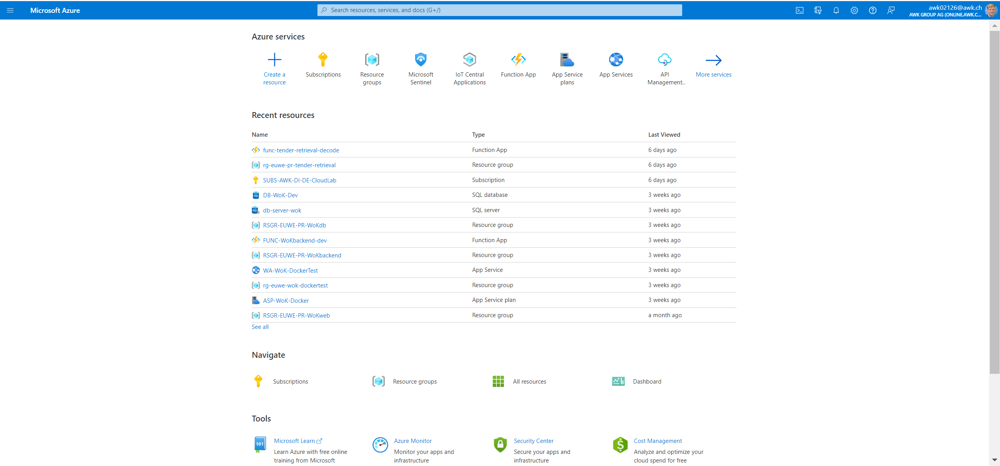
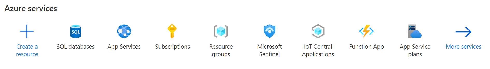
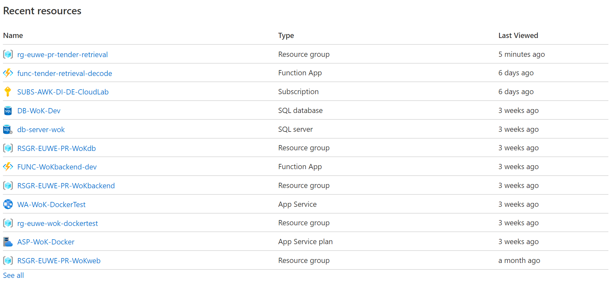
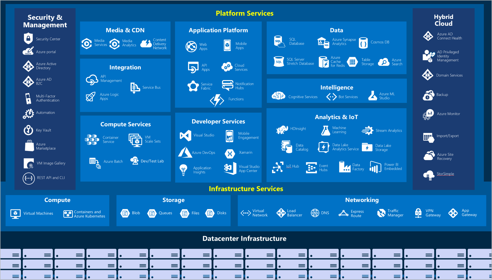

# Part 1: Learning in a sandbox environment <!-- omit in toc -->

> ⏱ Estimated learning time: 1 hour*

## What will you achieve in this part <!-- omit in toc -->

* Get to know Azure Portal & have first experiences with Azure
* Understand core concepts of Azure

> 📑Note: If you have previous experience deploying resources on Azure, you might find this part repetitive.
> You are free to skip this part and proceed with the next part.
> Be sure to come back to this section if you are unfamiliar the terms used in later sections.

***

## Learning Path <!-- omit in toc -->

- [Enter the Azure universe](#enter-the-azure-universe)
  - [Create your own Azure account and associate it with AWK](#create-your-own-azure-account-and-associate-it-with-awk)
  - [First steps with Azure Portal](#first-steps-with-azure-portal)
- [Basic terms & fundamental concepts inside Azure](#basic-terms--fundamental-concepts-inside-azure)
  - [Azure Service](#azure-service)
  - [Resource](#resource)
  - [Resource Group](#resource-group)
  - [Subscription](#subscription)
  - [Azure Region](#azure-region)
- [Make your first deployments on Azure](#make-your-first-deployments-on-azure)
  - [Storage account](#storage-account)
  - [Compute power in Azure](#compute-power-in-azure)
  - [Cost calculations](#cost-calculations)

***

## Enter the Azure universe

### Create your own Azure account and associate it with AWK

Before we start you need to create your own Azure account associated to your AWK-emailadress.
To do so follow these steps:

1. Go to the [Azure Portal](https://portal.azure.com)
2. Choose "Login options" (EN) or "Anmeldeoptionen" (DE)
3. Choose "" (EN) or "Bei einer Organisation anmelden" (DE)
4. Insert "awk.ch" as domain and proceed
5. Use SSO or sign in with your AWK Microsoft account

Congrats, the very first step is done!

At that point, a short remark on what an Azure account is:

* The Azure account is your identy for Azure.
* Access and rights are given to an Azure account.
* An Azure account is not necessarily for billing purposes. Billing is associated on Subscription level (see below).

> 📑Note: You should not be asked for credit card information if you follow the above steps.
> Though, if it happens contact [Lukas Möller](mailto:lukas.moeller@awk.ch) or Jesko Mueller for assistance.
>
> 📑Note: You can also create a free Azure account either with your AWK adress or a private emailadress following [these steps](https://docs.microsoft.com/en-us/learn/modules/create-an-azure-account/3-exercise-create-an-azure-account) but a credit card is needed in that scenario.

### First steps with Azure Portal

After your login, you should see a starting page similar to this:

On the starting page you can already see a lot.
We will go through the different sections and shortly describe what is displayed and what it can be used for.

On the top of the screen, you have the navigation bar:

1. **Menu bar**: In the menu you can find most other options that are accessible from the starting page and some additional ones.
2. **Home-Button**: This always brings you back to to the starting page.
3. **Search bar**: You can search for resource names (to find existing resources) or resource types (to deploy new ones). For more on resources see below.
4. **Cloud shell**: Opens up a shell interface to interact with Azure using command-line-interface (CLI).
5. **Directories/Subscriptions**: Gives you an overview for all your subscriptions and let you change between them. For more on subscriptions see below.
6. **Settings**: Access to your personal Azure settings (e.g. languages, themes).

> 💡Tip: Change your language to "English" and regional format to "English (United States)".
> This way error notes and looking for help in the internet is much easier.

Next, there is an Azure Service bar with the Azure services you last used.
You can either create a new resource or directly navigate to the last services you used.

Below you find a list of your recent resources (which should be empty for you at the moment).
You can directly go to the resources from here.

***

## Basic terms & fundamental concepts inside Azure

We already mentioned the concepts "Azure account", "Azure Service" and "Resource" in the previous chapter.
There are a few more fundamental concepts that need to be known to navigate Azure successfully.

### Azure Service

Azure services are the term for all available services and features on Azure.
The services can be divided in several categories. The most commonly used are:

* Compute
* Networking
* Storage
* Databases
* Web
* Internet of Things (IoT)
* Big data
* AI
* DevOps

This graphic gives an overview of many available services:

### Resource

Resources are manageable item that are available through Azure.
These resources are anything you create in an Azure subscription like VMs, Azure Application Gateway instances, and Azure Cosmos DB instances.

> 💡Tip: Be careful with deleting or changing single resources, they might be connected to each other and you might find resources in your account that you have never (knowingly) created
> 
> This could occur, because Azure creates resources automatically that are needed for the creation of another resource.
> E.g. you cannot create a virtual machine without a virtual network.

Each resource has a **resource type** that is often the same as the associated Azure service.
Each resource also have a **resource name** which can be chosen during the creation.
For some resource types it has to be unique on a subscription level or Azure wide.

> ❗ACL Remark: Inside ACL, we follow a naming concept for resources.
> It can be found [here]().
> All resource names should follow a certain pattern *loga-example-purpose*, where the name should start with a 3-4 letter acronym of the resource type followed by the purpose of the resource.

### Resource Group

Resource groups are a fundamental element of the Azure platform.
A resource group is a logical container for resources deployed on Azure.
All resources must be in a resource group, and a resource can only be a member of a single resource group.
Many resources can be moved between resource groups with some services having specific limitations or requirements to move. Resource groups can't be nested.
Before any resource can be provisioned, you need a resource group for it to be placed in.

> ❗ACL Remark: Inside ACL, we follow a naming concept for resource groups.
> It can be found [here]().
> All resource group names should follow a certain pattern *rg-euwe-pr-example-purpose*, where the name should start with *rg* followed by the Azure region (see below), a tag for the environment (pr: production, dev: development) and the purpose.

### Subscription

 Using Azure requires an Azure subscription.
 An Azure subscription is a logical unit of Azure services that links to an Azure account, which is an identity in Azure Active Directory (Azure AD) or in a directory that Azure AD trusts.
 Billing is organised on the subscription level.
 A subscription provides you with authenticated and authorized access to Azure products and services.
 It also allows you to provision resources.

 An account can have multiple subscriptions that have different billing models and to which you apply different access-management policies.
 You can use Azure subscriptions to define boundaries around Azure products, services, and resources.

### Azure Region

Resources are created in regions, which are different geographical locations around the globe that contain Azure datacenters.
Azure is made up of datacenters located around the globe.
When you use a service or create a resource such as a SQL database or virtual machine (VM), you're using physical equipment in one or more of these locations.
These specific datacenters aren't exposed to users directly.
Instead, Azure organizes them into regions.
As you'll see later in this unit, some of these regions offer availability zones, which are different Azure datacenters within that region.

A region is a geographical area on the planet that contains at least one but potentially multiple datacenters that are nearby and networked together with a low-latency network.
Azure intelligently assigns and controls the resources within each region to ensure workloads are appropriately balanced.

> 📑Note: When you deploy a resource in Azure, you'll often need to choose the region where you want your resource deployed.
> 
> 📑Note: Inside ACL we mostly use *West Europe* or *North Europ*.

## Make your first deployments on Azure

Now everything is set up to do your first deployments in the (Azure) cloud. 🎉

In the following you will use free sandbox environments provided by Azure.
You have a certain time limit to finish a sandbox.
After finishing the sandbox or after the time limit is over, all progress will be deleted.
You can use up to 10 sandbox environments per day.

### Storage account

We start by creating a storage account, which can be used to store files and data. To do so follow the step-by.step-guide in this modul [Create storage account](https://docs.microsoft.com/en-us/learn/modules/create-azure-storage-account/5-exercise-create-a-storage-account). 

### Compute power in Azure

The second-most fundamental service is compute power out of the cloud. Azure compute is an on-demand computing service for running cloud-based applications. It provides computing resources such as disks, processors, memory, networking, and operating systems.

Azure supports a wide range of computing solutions for development and testing, running applications, and extending your datacenter. The service supports Linux, Windows Server, SQL Server, Oracle, IBM, and SAP. Azure also has many services that can run virtual machines (VMs). Each service provides different options depending on your requirements. Some of the most prominent services are:

* Azure Virtual Machines
* Azure Container Instances
* Azure App Service
* Azure Functions (or serverless computing)

We want to start now by setting up your first virtual machine inside Azure. You can either choose to [Create a Windows virtual machine](https://docs.microsoft.com/en-us/learn/modules/create-windows-virtual-machine-in-azure/) (recommended for people with no coding experience)
or [Create a Linux virtual machine](https://docs.microsoft.com/en-us/learn/modules/create-linux-virtual-machine-in-azure/). To do so follow the step-by-step-guide in the linked module.

### Cost calculations

Until now we have not talked about costs and billing of the services you receive from Azure.
But of course Microsoft wants to earn money with Azure.

Azure resources are available on-demand and can typically be made available in minutes or even seconds.
You pay only for the resources you use, and only for as long as you're using them (normally a fixed price per hour, per GB or per computation cycle).

> E.g. You can save money by turning down your VM over night, when you do not use it or by deleting files/data in a storage account you do not need anymore.

This fundamental concept of cloud computing is important to understand the further advanced pricing models.

Often, you have the possibility to choose a **Tree (or Dev) Tier**, when deploying a resource.
This can make sense if you want to save money.
But be aware of the limitations that come with it.

* Free Tier resources often have a limited functionality compared to other Tiers.
* More importantly, Free Tier resources often come with no guaranteed availability. (E.g. your resource can be simply shutdown by Azure in case they need the compute power for another user.)

Other Pricing Tiers vary in guaranteed availability, functionality, scalibility or start-up time.

## Finish <!-- omit in toc -->

You can now become an ACL trainee. To do so follow [this instruction](TODO)

Back to [Part 0: Theoretical Basis](../part-0-theory/main.md)

Back to [overview page](../main.md)
