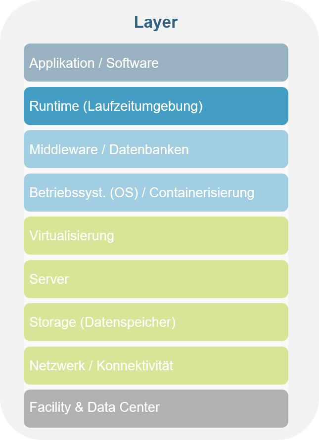

# Azure Function

Description:
Azure Functions is a cloud service available on-demand that provides all the continually updated infrastructure and resources needed to run your applications.
You focus on the pieces of code that matter most to you, and Functions handles the rest.
Functions provides serverless compute for Azure.
You can use Functions to build web APIs, respond to database changes, process IoT streams, manage message queues, and more.

In simple words: Azure functions enables you to run code in the cloud without worrying about servers, hosting and so on. Different programming languages are supported (C#, JavaScript, .NET (Core), Javam PowerShell, Python, TypeScript).

## Fact Sheet

[Insert fact sheet of Joel ❌ TODO]

You are at this layer of cloud computing:

## Learning Path

Deploy your first Azure Function (choose one):

* [Using Visual Studio Code](https://docs.microsoft.com/en-us/learn/modules/develop-azure-functions/)
* [Using Visual Studio](https://docs.microsoft.com/en-us/learn/modules/develop-test-deploy-azure-functions-with-visual-studio/)
* [Using Azure Core Tools, CLI-interface](https://docs.microsoft.com/en-us/learn/modules/develop-test-deploy-azure-functions-with-core-tools/)

> ❗ACL Remark: Best practice is to create a GitHub repository to version the code.

> ❗ACL Remark: For a business critical application or for collaboration you should consider setting up a CI/CD-pipeline for your Azure function (see further knowledge). We are currently working on templates for CI/CD-pipeline for Azure functions.

Further Knowledge (optional):

* [Automate your function deployment with Azure DevOps](https://docs.microsoft.com/en-us/learn/modules/deploy-azure-functions/)
* [Automate your function deployment using GitHub Action](https://docs.microsoft.com/en-us/azure/azure-functions/functions-how-to-github-actions?tabs=dotnet)

## Best practices

### Choose correct hosting plan

When you create a function app in Azure, you must choose a hosting plan for your app. The plan you choose has an effect on performance, reliability, and cost. There are three basic hosting plans available for Functions:

* Consumption plan
* Premium plan
* Dedicated (App Service) plan

The hosting plan you choose determines the following behaviors:

* How your function app is scaled based on demand and how instances allocation is managed.
* The resources available to each function app instance.
* Support for advanced functionality, such as Azure Virtual Network connectivity.

To learn more about choosing the correct hosting plan and for a detailed comparison between the plans, see [Azure Functions hosting options](https://docs.microsoft.com/en-us/azure/azure-functions/functions-scale).

It's important that you choose the correct plan when you create your function app. Functions provides a limited ability to switch your hosting plan, primarily between Consumption and Elastic Premium plans. To learn more, see Plan migration.

> ❗ACL Remark: In most cases, the consumption plan will fulfill your needs inside ACL.

### Performance and reliability

Generally, follow best practices from classical coding. But there are a few design principles that are specific for the serverless functions like Azure functions:

* Avoid long running functions.
* Plan cross-function communication.
* Write functions to be stateless.
* Write defensive functions.

For detailed explanations of these principles have a look at the [Microsoft documentation](https://docs.microsoft.com/en-us/azure/azure-functions/performance-reliability).

### Error handling

Capturing and logging errors is critical to monitoring the health of your application. The top-most level of any function code should include a try/catch block. In the catch block, you can capture and log errors.

### Security

> ❗ACL Remark: We are currently working on the standards of securing Azure functions inside ACL. For now:
>
> * Minimize the access (e.g. restrict CORS, require authentication/authorization)
> * Do not store secrets inside the code (Use Key Vault)
> * Require HTTPS
> * Monitor your function

## ACL Projects with use of this ressource

* Wheel of Knowledge (backend)
* TED Tender retrieval (handle XML files)
* Rapid response button (decode events)

Back to [Part 2](../main.md)

Back to [overview page](../../main.md)
