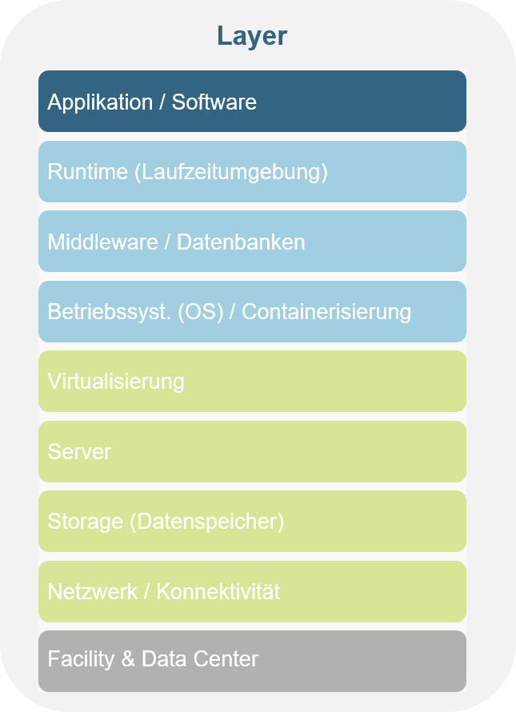

# Logic Apps

Description:
Azure Logic Apps is a platform for creating and running automated workflows (similar to PowerAutomate) that integrate your apps, data, services, and systems.
You can create processes with business logic and integrate other systems that can be run as automated workflows.
Many connectors are available, so that you can use all sort of APIs and connect to different data sources and applications.

You do not need any coding know-how as logic app is a low-code platform.

## Fact Sheet

[❌ TODO Insert fact sheet based on Joel's proposal]

--> You are here: link to layer model

## Learning Path

Choose one:

* [Create your first Azure Logic App](https://docs.microsoft.com/en-us/azure/logic-apps/quickstart-create-first-logic-app-workflow)
* [Create a twitter tracker Logic App](https://docs.microsoft.com/en-us/learn/modules/route-and-process-data-logic-apps/)

> ❗ACL Remark: We are currently working on a versioning & Dev/Prod (envs) concept for Logic Apps (Github / alternatives). Templates for Logic Apps and best practices for error handling & logging of Logic Apps inside ACL will be introduced soon (Status: January 2022).

Want to take a deeper dive:

* [Use custom connectors to handle arbitrary APIs](https://docs.microsoft.com/en-us/learn/modules/logic-apps-and-custom-connectors/)
* [Deploy Logic Apps using code (ARM) templates](https://docs.microsoft.com/en-us/learn/modules/create-deploy-logic-apps-using-arm-templates/)
* [Create Logic Apps with Visual Studio Code](https://docs.microsoft.com/en-us/azure/logic-apps/quickstart-create-logic-apps-visual-studio-code)
* [Deploy Logic Apps using pipeline](https://docs.microsoft.com/en-us/azure/logic-apps/set-up-devops-deployment-single-tenant-azure-logic-apps?tabs=github) (builds on knowledge from previous two items)

## ACL Projects that make use of this resource

* Project sharepoint creation automation
* TED Tender retrieval (orchestration & process)
* Rapid response button (process)

Back to [Part 2](../main.md)

Back to [overview page](../../main.md)
