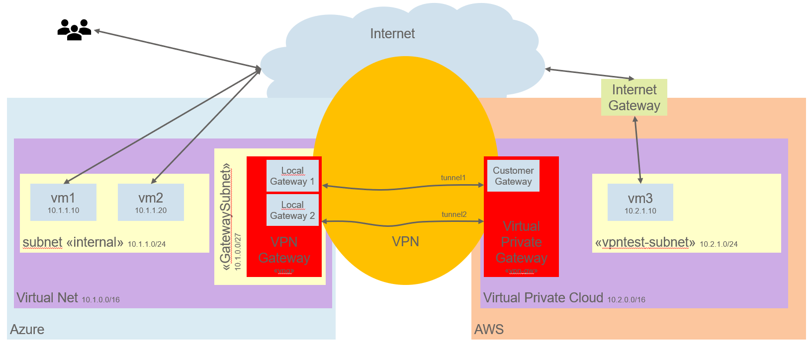
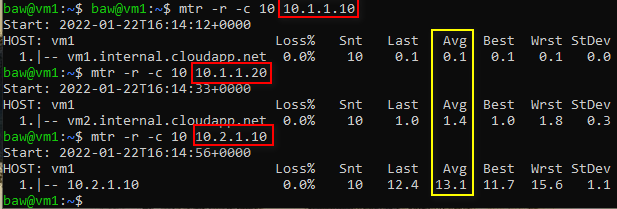
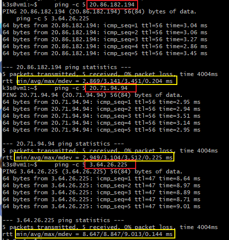

# Lab: VPN Network connectivity between VMs on Azure und AWS

>Documentation on how to setup a VPN connection between Azure and AWS

>Main contact: Werner Baumann (werner.baumann@awk.ch)

## Goal
The goal of this experiment is to let virtual machines in Azure and AWS communicate with each other. Not via the internet, but over a virtual private network (VPN) that is built between Azure and AWS and secured with IPSec. The system overview looks like this:



Once the infrastructure is ready, we will carry out some tests to see that it really works as intended.

---

## Preparation
In order to start, we need to have some prerequites in place. If not yet there, create the necessary keys and install the necessary tools on your computer.

### Create SSH keys
Create SSH keys to access the virtual machines over SSH.
#### Azure
```bash
    # create SSH key for login on Azure virtual machines
    ssh-keygen \
    -t rsa \
    -b 4096 \
    -C "azure" \
    -f ~/.ssh/id_azure \
    -N <key-passphrase>
```
#### AWS
```bash
    # create SSH key for login on AWS virtual machines
    ssh-keygen \
    -t rsa \
    -b 4096 \
    -C "aws" \
    -f ~/.ssh/id_aws \
    -N <key-passphrase>
```

### Download and install Azure CLI
Download the Azure CLI (command line interface) to create and destroy resources on Azure.
- download from https://docs.microsoft.com/en-us/cli/azure/install-azure-cli
- install it
- set the path in the command shell you are using

### Download and install AWS CLI
- download from https://docs.aws.amazon.com/cli/latest/userguide/getting-started-install.html
- install it
- set the path in the command shell you are using

### Optional: Download and install Terraform
- download from https://www.terraform.io/downloads
- install it
- set the path in the command shell you are using

---

## Useful Links
For all of you who want to read further information on this topic, see these links below for additional, step-by-step instructions. These where the basics used for this experiments.
- https://techcommunity.microsoft.com/t5/fasttrack-for-azure/how-to-create-a-vpn-between-azure-and-aws-using-only-managed/ba-p/2281900
- https://docs.microsoft.com/en-us/learn/modules/connect-on-premises-network-with-vpn-gateway/
- https://docs.aws.amazon.com/vpn/latest/s2svpn/SetUpVPNConnections.html

While writing this article, I made extensive use of the following:
- CLI
    - Azure CLI command reference: https://docs.microsoft.com/en-us/cli/azure/?view=azure-cli-latest
    - AWS CLI command reference: https://docs.aws.amazon.com/cli/latest/reference/index.html
- [Terraform](https://www.terraform.io/)
    - Azurem module: https://registry.terraform.io/providers/hashicorp/azurerm/latest/docs
    - AWS moduel: https://registry.terraform.io/providers/hashicorp/aws/latest/docs
---

## Setup network connectivity between Azure and AWS
For all those who just want to get it done and who are more interested in the result (having a working VPN connection): all the necessary steps are part of the Terraform scripts that accompain this article. (see [main.tf](main.tf)). So if you want a quick start, check and adapt the settings in [variables.tf](variables.tf) and then type
```bash
    terraform init
    terraform apply
```
in the actual path. You need to provide your email address (for tagging the resources), as well as the username for the Azure VMs. Make sure you have a valid SSH key for the user given, or the script will fail.

"Quick start" means about 45 minutes (the setup of a VirtualNetwork-Gateway at Azure takes about 30 minutes itself). After this, the built-up infrastructure is ready to be used and tested according the chapter [Tests](#tests) getestet werden.

For those who want to go through this step-by-step, this is how it can be done with Azure and AWS CLI.

> **Note**: whenever you see ```<username>``` or some other term in ```<..>```, please fill in the necessary value. This might be your username, an IP address or some other value.

> **Note**: all command line examples assume you are using a UNIX/Linux shell (e.g. bash). On Windows,  GitBash is a viable solution.

---

### Azure (part 1)
- as ususal, start by creating a resource group. Best practice is to contain the enviroment name (dev), your username and a name for this project (e.g. vpntest). This is to let others know that this is your resources they are tinkering with.
    ```bash
        # create a new resource group to contain all resources for this experiment
        az group create -l westeurope -n rg-euwe-dev-<username>-vpntest
    ```

- create a virtual net in the range ```10.1.0.0```, including the subnet ```internal``` where our virtual machines will be placed.
    ```bash
        # create a new VNET inside this new group. incl. subnet "internal"
        az network vnet create -g rg-euwe-dev-<username>-vpntest -l westeurope \
            -n vpntest-vn1  \
            --address-prefix 10.1.0.0/16 \
            --subnet-prefix 10.1.1.0/24 \
            --subnet-name internal
    ```

- create the gateway subnet which is needed to attach the virtual network gateway to this virtual net. Make sure the name is ```GatewaySubnet```, as this is required by the virtual network gateway. Note the subnet mask /27 - this is a small subnet with only 32 addresses.
    ```bash
        az network vnet subnet create --address-prefixes "10.1.0.0/27" \
            --name "GatewaySubnet" \
            --resource-group rg-euwe-dev-<username>-vpntest \
            --vnet-name vpntest-vn1
    ```
- we are now ready to create the virtual network gateway. For this, we need a public IP address in order that we can reach the VNG from the internet and therefore from AWS, too.
    ```bash
        # create a Public IP address for the virtual network gateway
        az network public-ip create --name "pip-azure-vpn-gw" \
            --resource-group rg-euwe-dev-<username>-vpntest \
            --allocation-method Dynamic \
            --sku Basic
    ```
- then, we create the virtual network gateway itself. It is located on the virtual net we created prior, and will automatically be assigned an IP address from the ```GatewaySubnet```. Make sure we create a route-based VPN and assign the public IP address.
    ```bash
        # create the virtual network gateway
        az network vnet-gateway create -g rg-euwe-dev-<username>-vpntest \
            -n "vng" \
            --public-ip-address pip-azure-vpn-gw \
            --vnet vpntest-vn1 \
            --gateway-type Vpn \
            --sku Basic \
            --vpn-type RouteBased \
            --no-wait
    ```
>**Note**: the option ```--no-wait``` at the end of the statement tells the command to return back ASAP. As the creation of a virtual network gateway can take quite some time (~30 minutes), the statement should run and we check later for the successul creation of our VNG.

---

### AWS
Let us continue with the setup on AWS.
- First, create a VPC (Virtual Private Cloud) with an IP address range of ```10.2.0.0/16```. We tag the VPC with information on ourself and the environment. Additionally, we enable DNS for the hostname. To be faster, we will store the IDs of the most important resources in Variables like ```AWS_VPC_ID```, and reuse them in other commands as ```$AWS_VPC_ID```.
    ```bash
        # create VPC, store ID in variable 
        AWS_VPC_ID=$(aws ec2 create-vpc \
            --cidr-block 10.2.0.0/16 \
            --query 'Vpc.{VpcId:VpcId}' \
            --output text \
            --tag-specifications ResourceType=vpc,Tags='[{Key=Name,Value="vpntest-aws-vnet"},{Key=Environment,Value="dev"},{Key=Owner,Value="<username>"}]')

        # enable DNS hostname
        aws ec2 modify-vpc-attribute \
            --vpc-id $AWS_VPC_ID \
            --enable-dns-hostnames "{\"Value\":true}"
    ```
- now we configure the protocols SSH and ICMP to be allowed in default security group. To do that, we first need to query AWS for the default security group ID, and then use this in our updates.
    > **ATTENTION**: This allows SSH access and ICMP traffic from everywhere in the Internet .. this is for testing purpose only. Do **NOT** use this setting in production!!

    ```bash
        # get ID of default security group 
        AWS_DEF_SG_ID=$(aws ec2 describe-security-groups \
            --query 'SecurityGroups[].{GroupId:GroupId}' \
            --output text \
            --filters Name=vpc-id,Values=$AWS_VPC_ID)

        # allow SSH from everywhere
        aws ec2 authorize-security-group-ingress \
            --group-id $AWS_DEF_SG_ID \
            --protocol tcp \
            --port 22 \
            --cidr 0.0.0.0/0

        # allow ICMP from everywhere
        aws ec2 authorize-security-group-ingress \
            --group-id $AWS_DEF_SG_ID \
            --protocol icmp \
            --pot -1
            --cidr 0.0.0.0/0
    ```

- now we create the Internet gateway to allow access to our virtual net from the Internet, and we attach it to the VPC
    ```bash
        # create internet GW, store ID for later use 
        AWS_IGW_ID=$(aws ec2 create-internet-gateway \
            --tag-specifications 'ResourceType=internet-gateway,Tags=[{Key=Name,Value=vpntest-aws-vnet}]' \
            --output text --query 'InternetGateway.InternetGatewayId')

        # attach IGW to our virtual private cloud 
        aws ec2 attach-internet-gateway \
            --internet-gateway-id $AWS_IGW_ID \
            --vpc-id $AWS_VPC_ID
    ```
- Now we are ready to create a subnet in our VPC. This is where our VMs will be at home.
    ```bash
        # create a subnet in our VPC 
        AWS_SUBNET_PUBLIC_ID=$(aws ec2 create-subnet \
            --vpc-id $AWS_VPC_ID --cidr-block 10.2.1.0/24 \
            --availability-zone eu-central-1a \
            --query 'Subnet.{SubnetId:SubnetId}' \
            --output text \
            --tag-specifications ResourceType=subnet,Tags='[{Key=Name,Value="vpntest-aws-subnet"},{Key=Environment,Value="dev"},{Key=Owner,Value="<username>"}]')
    ```

- Once this is done, we can create a Virtual Private Gateway and attach it to the VPC
    ```bash
        # create the virtual private gateway
        AWS_VPN_GW_ID=$(aws ec2 create-vpn-gateway --type ipsec.1 \
            --tag-specifications ResourceType=vpn-gateway,Tags='[{Key=Name,Value="vpntest-vpn-gateway"},{Key=Environment,Value="dev"},{Key=Owner,Value="<username>"}]' \
            --query 'VpnGateway.VpnGatewayId' \
            --output text )

        # attach VPN gateway to our virtual private cloud 
        aws ec2 attach-vpn-gateway \
            --vpc-id $AWS_VPC_ID \
            --vpn-gateway-id $AWS_VPN_GW_ID
    ```

- Next we create a customer gateway. A Customer Gateway is an object that tells AWS where to connect to at the other side (e.g. your local premise or, in this case, at Azure). Make sure to fill in the public IP address of the **Azure** VPN Gateway (which in the meantime might be assigned .. if not, you will have to wait until it is created, in order that you know the public IP address).
    ```bash
        # create customer gateway 
        AWS_CGW_ID=$(aws ec2 create-customer-gateway \
            --public-ip <public-IP-address-of-AZURE-VPN-gateway> \
            --type ipsec.1 --bgp-asn 65034 \
            --tag-specifications ResourceType=customer-gateway,Tags='[{Key=Name,Value="vpntest-cgw-azure"},{Key=Environment,Value="dev"},{Key=Owner,Value="<username>"}]' \
            --query 'CustomerGateway.CustomerGatewayId' \
            --output text)
    ```

- At last, we are ready to create the VPN site-to-site connection. This connects our VPN gateway with the customer gateway.
    ```bash
        # create VPN site-to-site connection
        AWS_VPN_CONN_ID=$(aws ec2 create-vpn-connection \
        --customer-gateway-id $AWS_CGW_ID \
        --type ipsec.1 \
        --vpn-gateway-id $AWS_VPN_GW_ID \
        --options "{\"StaticRoutesOnly\":true}" \
        --tag-specifications ResourceType=vpn-connection,Tags='[{Key=Name,Value="vpntest-vpn-conn"},{Key=Environment,Value="dev"},{Key=Owner,Value="<username>"}]' \
        --query 'VpnConnection.VpnConnectionId' \
        --output text)
    ```
- we also need to add a route to the VPN connection which points towards the Azure subnet ```10.1.0.0/16```.
    ```bash
        # add static route to VPN connection
        aws ec2 create-vpn-connection-route \
            --destination-cidr-block 10.1.0.0/16 \
            --vpn-connection-id $AWS_VPN_CONN_ID
    ```

- as a last step, we need to setup the routing for our VPC. First, we need to get the ID of our default routing table for our VPC. Then, we add rules  as follows:
    - traffic for the subnet at Azure (10.1.0.0/16) should be routed to our Virtual Private Gateway identified by ```AWS_VPN_GW_ID```
    - traffic for the Internet (0.0.0.0/0) should be routed to our Internet gateway identified by ```AWS_IGW_ID```
    ```bash
        # get ID of default route table
        AWS_DEF_RT_ID=$(aws ec2 describe-route-tables \
            --query 'RouteTables[].{RouteTableId:RouteTableId}' \
            --output text \
            --filters Name=vpc-id,Values=$AWS_VPC_ID)

        # create route for Azure network
        aws ec2 create-route \
            --route-table-id $AWS_DEF_RT_ID \
            --destination-cidr-block 10.1.0.0/16 \
            --gateway-id $AWS_VPN_GW_ID

        # create route for Internet
        aws ec2 create-route \
            --route-table-id $AWS_DEF_RT_ID \
            --destination-cidr-block 0.0.0.0/0 \
            --gateway-id $AWS_IGW_ID
    ```

- before we can conclude the configuration for AWS, we need to know the Pre-Shared-Key (PSK) and public IP addresses of our VPN connection at AWS. We need this later to setup the VPN tunnels at Azure. You can obtain this information with the command
    ```bash
        aws ec2 describe-vpn-connections \
            --vpn-connection-ids $AWS_VPN_CONN_ID \
            --query 'VpnConnections[].Options.TunnelOptions' 
    ```
    and get something similar to the values below.
    ```json
        [
            [
                {
                    "OutsideIpAddress": "18.157.106.124",
                    "TunnelInsideCidr": "169.254.69.72/30",
                    "PreSharedKey": "6irrbuX37GIKUfqN8srYskzb.O.KcYYJ"
                },
                {
                    "OutsideIpAddress": "18.193.164.15",
                    "TunnelInsideCidr": "169.254.124.152/30",
                    "PreSharedKey": "Hyz3B9FPIjdadwmmUZRRW4F3et.xW4og"
                }
            ]
        ]
    ```

- last but not least, we create a virtual machine in our subnet at AWS. To access the VM later, we import our public key which we already created in the beginning and assign the VM a public and a private IP address. 
    ```bash
        # import public key to AWS, for access to virtual machines
        AWS_KEYPAIR_ID=$(aws ec2 import-key-pair --key-name vpntest-key-pair \
            --tag-specifications ResourceType=key-pair,Tags='[{Key=Name,Value="vpntest-key-pair"},{Key=Environment,Value="dev"},{Key=Owner,Value="<username>"}]' \
            --query 'KeyPairId'  \
            --output text \
            --public-key-material fileb://~/.ssh/id_aws.pub)

        # create VM instance, with Ubuntu LTS, fixed private IP address 
        AWS_VM3_ID=$(aws ec2 run-instances \
            --instance-type t2.micro \
            --image-id "ami-0d527b8c289b4af7f" \
            --private-ip-address 10.2.1.10 \
            --key-name vpntest-key-pair \
            --associate-public-ip-address \
            --subnet-id $AWS_SUBNET_PUBLIC_ID \
            --tag-specifications ResourceType=instance,Tags='[{Key=Name,Value="vpntest-vm3"},{Key=Environment,Value="dev"},{Key=Owner,Value="<username>"}]' \
            --query 'Instances[].InstanceId' \
            --output text)
    ```
---

### Azure (part 2)
We now finish the setup at the Azure side of the VPN connection. 
- First, create a local gateway for **each** VPN tunnel to AWS. This tells Azure at which public IP addresses the Virtual Private Gateway at AWS is reachable.
    ```bash
        # create local gateway #1
        az network local-gateway create -n vpntest-aws-local-gw1 \
            --resource-group rg-euwe-dev-<username>-vpntest \
            --gateway-ip-address <first OutsideIpAddress from AWS output> \
            --local-address-prefixes 10.2.0.0/16
        
        # create local gateway #2
        az network local-gateway create -n vpntest-aws-local-gw2 \
            --resource-group rg-euwe-dev-<username>-vpntest \
            --gateway-ip-address <second OutsideIpAddress from AWS output> \
            --local-address-prefixes 10.2.0.0/16
    ```

- Now, we create the IPSec connections on the VPN gateway. This takes some time, but after several seconds, the tunnels are created and will be in status UP.
    ```bash
        # create tunnel #1 on the virtual network gateway
        az network vpn-connection create --name "vpntest-vnet-gw-tunnel1"\
            --resource-group rg-euwe-dev-<username>-vpntest \
            --vnet-gateway1 vng \
            --local-gateway2 vpntest-aws-local-gw1 \
            --shared-key "<first PSK from AWS output>"

        # create tunnel #2 on the virtual network gateway
        az network vpn-connection create --name "vpntest-vnet-gw-tunnel2"\
            --resource-group rg-euwe-dev-<username>-vpntest \
            --vnet-gateway1 vng \
            --local-gateway2 vpntest-aws-local-gw2 \
            --shared-key "<second PSK from AWS output>"
    ```

- to finish, we create two virtual machines in Azure for testing.
    ```bash
        # create VM1: Ubuntu LTS, access with our public key, private IP address
        az vm create -n vm1 \
            --resource-group rg-euwe-dev-<username>-vpntest \
            --image ubuntults \
            --vnet-name vpntest-vn1 \
            --subnet internal \
            --private-ip-address 10.1.1.10\
            --public-ip-sku Basic \
            --computer-name vm1 \
            --admin-username <username> \
            --ssh-key-values ~/.ssh/id_azure.pub \
            --size Standard_B1ls

        # create VM2: Ubuntu LTS, access with our public key, private IP address
        az vm create -n vm2 \
            --resource-group rg-euwe-dev-<username>-vpntest \
            --image ubuntults \
            --vnet-name vpntest-vn1 \
            --subnet internal \
            --private-ip-address 10.1.1.20\
            --public-ip-sku Basic \
            --computer-name vm2 \
            --admin-username <username> \
            --ssh-key-values ~/.ssh/id_azure.pub \
            --size Standard_B1ls
    ```
---

## Result & Tests {#tests}
At this point, 
- all VMs are reachable by SSH from the internet
    - when logging in, be aware that the username on the Azure VMs was specified while creating them (see [variables.tf](variables.tf) if you used ```terraform```), while the username on AWS is fixed, depending on the image (see https://docs.aws.amazon.com/AWSEC2/latest/UserGuide/managing-users.html)
    - vm1, vm2: user1 (or your own ```<username>```)
    - vm3: ubuntu

    ```bash
        # login to all VMs (execute each command in a separate window)
        ssh -i ~/.ssh/id_azure <username>@<public IP address vm1>
        ssh -i ~/.ssh/id_azure <username>@<public IP address vm2>
        ssh -i ~/.ssh/id_aws ubuntu@<public IP address vm3>
    ```
> **ATTENTION**: The settings and access to these systems is **NOT** acceptable for production use!!

- ICMP is possible to all VMs
    - test with ```ping``` or ```mtr``` and the IP addresses of the private/public network and compare them.
 
    - from vm1 (Azure), we test the ICMP packet time to itself, to vm2 (in the same subnet at Azure) and to vm3 (on AWS). The program mtr lets us run several test rounds (option ```-c 10```), and option ```-r``` gives us a report once the program is finished. Alternatively, use ```ping``` with option ```-c 5``` for 5 packets only. 
    ```bash
        # test private IP addresses
        mtr -r -c 10 10.1.1.10
        mtr -r -c 10 10.1.1.20
        mtr -r -c 10 10.2.1.10

        # test public IP addresses
        ping -c 5 20.86.182.194
        ping -c 5 20.71.94.94
        ping -c 5 3.64.26.225
    ```

    

- connectivity between all VMs is possible using the **private** IP addresses. This shows that our VPN is setup correctly. Using private IP addresses, we see that
    - the connection to vm1 is very fast, as it is a local connection to the network adapter only
    - connection to vm2 (10.1.1.20) on internal subnet is still fast (average of ~1.4ms)
    - ICMP packets to vm3 (10.2.1.10) take around 13ms to arrive, but they travel through our VPN to AWS
- using the public IP addresses yields a different result
    - connection to vm1 to itself and vm2 are now almost the same, as they travel through the whole IP stack.
    - connection to vm3 is over the internet, and is faster than via VPN. This is probably due to the VPN overhead (encryption etc.) 

        

Of course you can run the same tests from the other VMs, too. The result will show the same behaviour:
- very fast rount-trip-times to the local network adapter
- slightly longer times for VMs in the same subnet (~1.5ms)
- around ~3ms for VMs on the same subnet, using public IP addresses
- between 10-15ms for packets that travel through the VPN connection
- around ~9ms for packtes that travel through the internet

As can be seen, the VMs are able to communicate by using private IP addresses only. The routing and VPN gatway take care of sending the packets to the other cloud providers infrastructure.

---

## Clean up
- if you used Terraform to provision the resources, a simple ```terraform destroy``` will destroy all of it
    - if you have manually setup additional resources, you will have to delete them manually!
    
- if you followed this all through with Azure and AWS CLI, then this is how to delete all your stuff:
    - Azure: directly delete the resource group. All objects in the resource group will be deleted, too.
    - AWS:
        - start with deleting the VM, then the key pair
        - next, delete and detach the VPN site-to-site connection, the Virtual Private Gateway, the Customer Gateway and the Internet Gateway
        - now, delete the subnet, and the VPC
        > you might get a response reading "you can **not** delete X, as long as Y is using it". If so, delete Y, and then continue with deleting X.