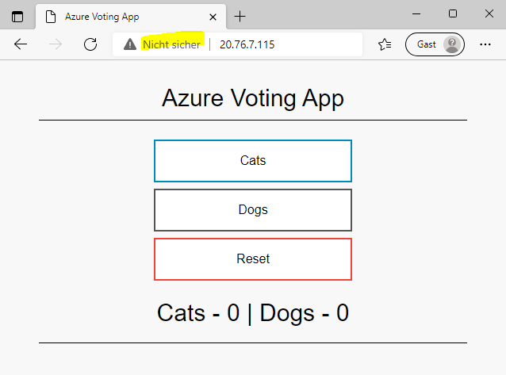

# Azure Kubernetes - Deploy First Application

>Documentation on the experiments carried out during the LabWeek 2022 on the AWK Cloud Lab

>Main contact: Werner Baumann (werner.baumann@awk.ch)

> go back to [Azure Kubernetes](../README.md)

## Deploy first application
In order to make it simple, we use the example provided by Microsoft at https://docs.microsoft.com/de-de/azure/aks/kubernetes-walkthrough#run-the-application.

The necessary deployment file is provided [here](./azure-vote.yaml)

in the CLI of your choice (either in Cloud Shell or locally), enter 
```
    kubectl apply -f azure-vote.yaml
```
resulting in 
```
    deployment.apps/azure-vote-back created
    service/azure-vote-back created
    deployment.apps/azure-vote-front created
    service/azure-vote-front created
```
When you now execute
```
    kubectl get pods
```
then you will get 
```
    NAME                                READY   STATUS    RESTARTS   AGE
    azure-vote-back-6c4dd64bdf-d2642    1/1     Running   0          12m
    azure-vote-front-85b4df594d-b5rlc   1/1     Running   0          12m
```
There are two new pods, running the backend and frontend of our first application.

We will now access the application with our web browser. In order to do this, we need to know the external IP address of the frontend service.
```
    kubectl get services -o wide
```
gives us
```
    NAME               TYPE           CLUSTER-IP     EXTERNAL-IP   PORT(S)        AGE   SELECTOR
    azure-vote-back    ClusterIP      10.0.229.53    <none>        6379/TCP       20m   app=azure-vote-back
    azure-vote-front   LoadBalancer   10.0.143.197   20.76.7.115   80:30248/TCP   20m   app=azure-vote-front
    kubernetes         ClusterIP      10.0.0.1       <none>        443/TCP        64m   <none>
```
Note the external IP address on the service "azure-vote-front", e.g. 20.76.7.115.

Head over with your browser to this URL (e.g. [```http://20.76.7.115/```](http://20.76.7.115/)) and you see

 

Voilà! Click on the buttons to vote for cats or dogs .. or both.

But, wait a minute .. the browser says we are using an insecure HTTP connection. This might be sufficient for our example, but not for a business application. We therefore must now think of how to secure the transport. 

Head over to the main article [Azure Kubernetes](../README.md#add-tls-ingress) and [add an ingress controller](../3-add-ingress/README.md).
