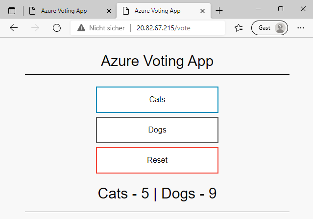
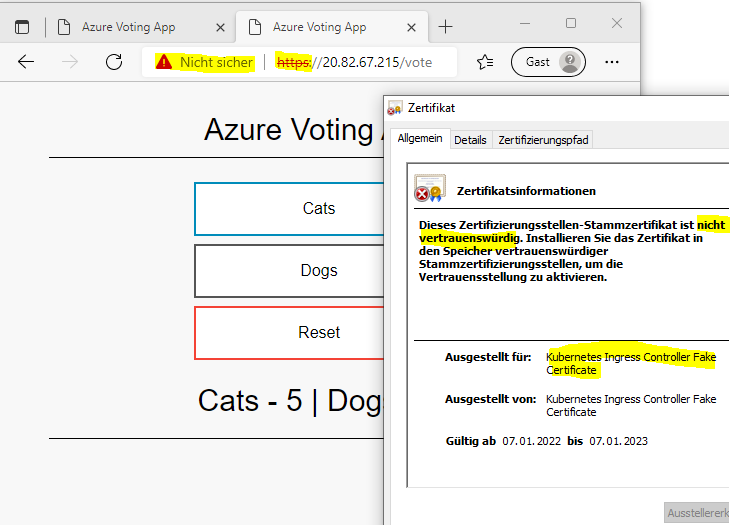

# Azure Kubernetes - Install an Ingress Controller

>Documentation on the experiments carried out during the LabWeek 2022 on the AWK Cloud Lab

>Main contact: Werner Baumann (werner.baumann@awk.ch)

> go back to [Azure Kubernetes](../README.md)

## Install an Ingress Controller
Before we can start to setup our TLS ingress, we need to install something called "ingress controller". Quoting https://docs.microsoft.com/en-us/azure/aks/ingress-basic, this is 
```
    ".. a piece of software that provides reverse proxy, configurable traffic routing, and TLS termination for Kubernetes services."
```

Why do we need to do that? Our application is a currently reachable at
```
    http://<external-IP-address-of-frontend>/
```

The goal is to reach it at
```
    https://<external-IP-address-of-ingress-controller>/<your-app-path>
```

The differences are
- protocol: instead of ```http://``` we will be using ```https://``` .. this is what the ingress controller is delivering us out-of-the-box (it is here to do some work!).
- external IP address: note that the IP address changes from the external IP address of the frontend to the external IP address of the ingress controller. As an ingress controller is there to serve several applications, we need to add
- ```<your-app-path>``` to the URL. This ensures that the ingress controller can route the traffic for our app based on the path.

As many times in life, we come to a point where you need to make a decision:
- install the ingress controller in an [easy way](#easy-way), and forget about it, and not knowing how to reproduce it later
- install the ingress controller in a [longer way](#longer-way) and in a controlled manner using [Helm](https://helm.sh/)

To make life as easy as possible, we could install the nginx-ingress-controller directly from the repo, even though the installation with a Helm chart might be favorable in a production environment. Heck, let's try the Helm way, too.

### Easy way: install directly from the repo {#easy-way}
As pointed out in https://kubernetes.github.io/ingress-nginx/deploy/#quick-start, we could run
```
    kubectl apply -f https://raw.githubusercontent.com/kubernetes/ingress-nginx/controller-v1.1.0/deploy/static/provider/cloud/deploy.yaml
```
and end up with an Nginx ingress controller (v1.1.0 is latest as of Nov. 2021). Check the new services available to us in the cluster:
```
    kubectl get services -n ingress-nginx
```

```
    NAME                                 TYPE           CLUSTER-IP    EXTERNAL-IP    PORT(S)                      AGE
    ingress-nginx-controller             LoadBalancer   10.0.60.137   20.82.67.215   80:30941/TCP,443:30336/TCP   139m
    ingress-nginx-controller-admission   ClusterIP      10.0.68.152   <none>         443/TCP                      139m
```
OK, all set. Our ingress controller is ready, and it has an **external** IP address at which we can reach it.

 We can now proceed with [Configure Ingress controller](#configure-ingress-controller).

**Wait**: if you decide now to take the [longer way](#longer-way), then you can immediately remove this ingress controller by deleting it again.
```
    kubectl delete -f https://raw.githubusercontent.com/kubernetes/ingress-nginx/controller-v1.1.0/deploy/static/provider/cloud/deploy.yaml
```
**Note**: in the last part of this tutorial, you will be using the cert-manager, which best is installed using helm .. think about installing the Ingress Controller with Helm, too.


### The longer way: Install with Helm {#longer-way}
If you would like to use Helm to install the Ingress Controller, of course you need to have helm. If you already have an installation, just skip the next section.

#### Install Helm
Find information on installing Helm at https://helm.sh/docs/intro/install/. Depending on your OS, you will find the necessary download and installation instructions there. Make sure to put your Helm directory on the search path so that you can use it.

Once installed, just run it on your command line with
```
    helm version
```
this shows something similar to
```
    version.BuildInfo{Version:"v3.7.2", GitCommit:"663a896f4a815053445eec4153677ddc24a0a361", GitTreeState:"clean", GoVersion:"go1.16.10"}
```

#### Install Helm chart for Nginx Ingress Controller
To install the ingress controller, we need to tell ```helm``` where to find the chart. This is done by issuing
```
    helm repo add ingress-nginx https://kubernetes.github.io/ingress-nginx && \
    helm repo update
```
The result in your shell would be
```
    "ingress-nginx" has been added to your repositories
    Hang tight while we grab the latest from your chart repositories...
    ...Successfully got an update from the "ingress-nginx" chart repository
    Update Complete. ⎈Happy Helming!⎈
```
To see which repositories you have in helm, enter
```
    helm repo list
```
which shows
```
    NAME            URL
    ingress-nginx   https://kubernetes.github.io/ingress-nginx
```
Next, we install the chart into our AKS cluster, which results in a release of an Ingress Controller in our cluster.
Enter 
```
    helm install my-nginx-ingress ingress-nginx/ingress-nginx 
    --namespace nginx-ingress --create-namespace 
    --set controller.replicaCount=2 
    --set controller.nodeSelector."kubernetes\.io/os"=linux 
    --set controller.admissionWebhooks.patch.nodeSelector."kubernetes\.io/os"=linux 
    --set defaultBackend.nodeSelector."kubernetes\.io/os"=linux
```
where ```my-nginx-ingress``` is the release name of the controller. When I installed it with this command, this is what i got in return:
```yaml
    NAME: my-nginx-ingress
    LAST DEPLOYED: Mon Jan 10 11:28:38 2022
    NAMESPACE: nginx-ingress
    STATUS: deployed
    REVISION: 1
    TEST SUITE: None
    NOTES:
    The ingress-nginx controller has been installed.
    It may take a few minutes for the LoadBalancer IP to be available.
    You can watch the status by running 'kubectl --namespace nginx-ingress get services -o wide -w my-nginx-ingress-ingress-nginx-controller'

    An example Ingress that makes use of the controller:
    apiVersion: networking.k8s.io/v1
    kind: Ingress
    metadata:
        name: example
        namespace: foo
    spec:
        ingressClassName: nginx
        rules:
        - host: www.example.com
            http:
            paths:
                - backend:
                    service:
                    name: exampleService
                    port:
                        number: 80
                path: /
        # This section is only required if TLS is to be enabled for the Ingress
        tls:
        - hosts:
            - www.example.com
            secretName: example-tls

    If TLS is enabled for the Ingress, a Secret containing the certificate and key must also be provided:

    apiVersion: v1
    kind: Secret
    metadata:
        name: example-tls
        namespace: foo
    data:
        tls.crt: <base64 encoded cert>
        tls.key: <base64 encoded key>
    type: kubernetes.io/tls  
```

## Configure Ingress controller {#configure-ingress-controller}
As a first step, we use the ingress controller, but do not add specific configuration for ```https://```.

The [ingress controller configuration](./azure-vote-http-ingress.yaml) looks like this:
```yaml
    apiVersion: v1
    kind: Service
    metadata:
    name: azure-vote-front
    spec:
    type: ClusterIP
    ports:
    - port: 80
    selector:
        app: azure-vote-front
    ---
    apiVersion: networking.k8s.io/v1
    kind: Ingress
    metadata:
    name: azure-vote-front-ingress
    annotations:
        kubernetes.io/ingress.class: nginx
        nginx.ingress.kubernetes.io/ssl-redirect: "false"
        nginx.ingress.kubernetes.io/use-regex: "true"
        nginx.ingress.kubernetes.io/rewrite-target: /$1
    spec:
    rules:
    - http:
        paths:
        - path: /vote(/|$)(.*)
            pathType: Prefix
            backend:
            service:
                name: azure-vote-front
                port:
                number: 80
        - path: /(.*)
            pathType: Prefix
            backend:
            service:
                name: azure-vote-front
                port:
                number: 80
```
Important points to note in the configuration file:
- the Service ```azure-vote-front``` is now configured to be of type ```ClusterIP```, which means it has no longer an external IP address provided by the former type ```LoadBalancer```
- we add an Ingress resource that directs traffic from the ingress controller to our application, either when using our new ```<app-path>``` ```/vote``` but also if we use no path at all

Apply this configuration:
```
    kubectl apply -f azure-vote-http-ingress.yaml
```
and you get 
```
    service/azure-vote-front configured
    ingress.ne tworking.k8s.io/azure-vote-front-ingress created
```
In the output, note that while the Ingress was **created**, the service for our frontend was **changed**. This is the behaviour of Kubernetes: it tells you what is has done when applying a configuration.

If you execute 
```
    kubectl get ingress
```
you will find that our ingress for the application is using the same IP address as the ingress controller. Well, this ought to be, as the Ingress Controller allows to reach our application from externally.

### Test our app with Ingress Controller and ```http://```
Now, open your browser at [```http://20.82.67.215/```](http://20.82.67.215/) and you can reach our application using the ingress controller.
In addition, we can also reach it at [```http://20.82.67.215/vote```](http://20.82.67.215/vote)

 

### Test our app with Ingress Controller and ```https://```
Now, open your browser at [```https://20.82.67.215/```](https://20.82.67.215/) or [```https://20.82.67.215/vote```](https://20.82.67.215/vote) and you reach our application using the ingress controller - this time using ```https://```!

 

 As you can see, the Ingress Controller provides his service also with ```https://```, but the certificate used is not trusted by the browser, and this is why we need to add some more configuration.

Return to the main article [Azure Kubernetes](../README.md#remove-resources) and [add TLS to our ingress](../4-add-tls-ingress/README.md).
