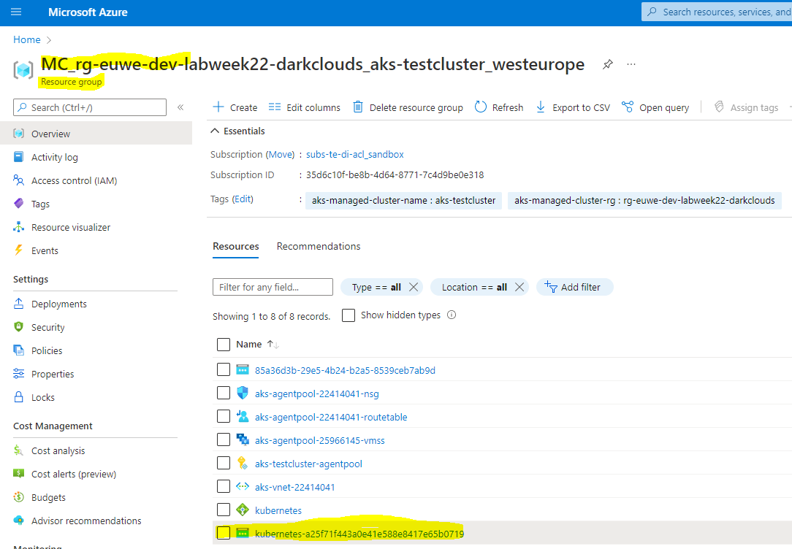
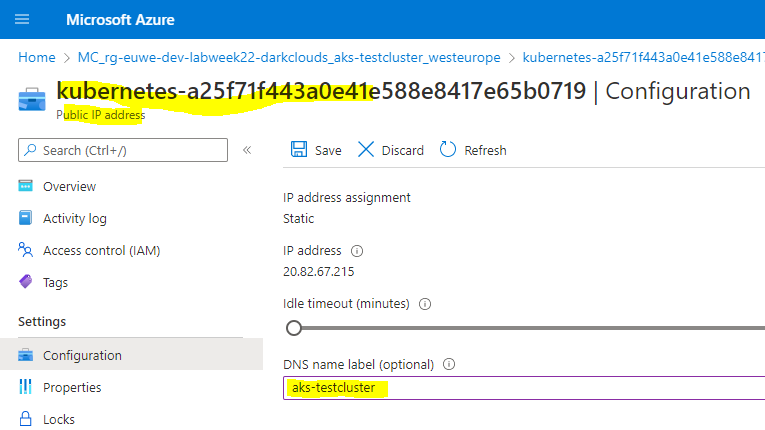
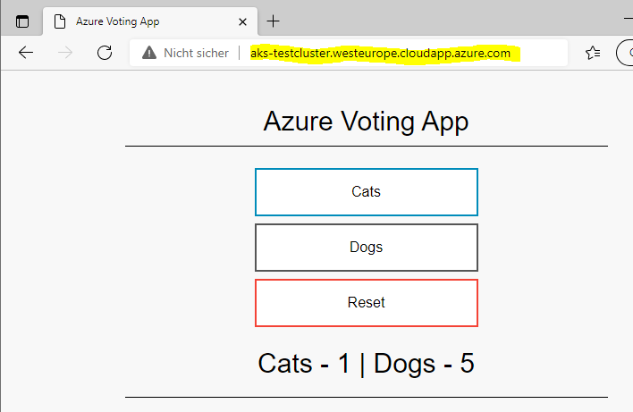
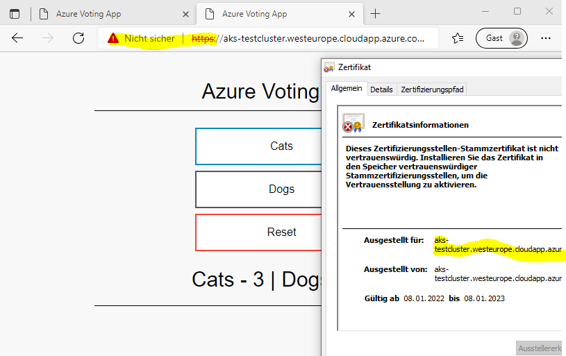
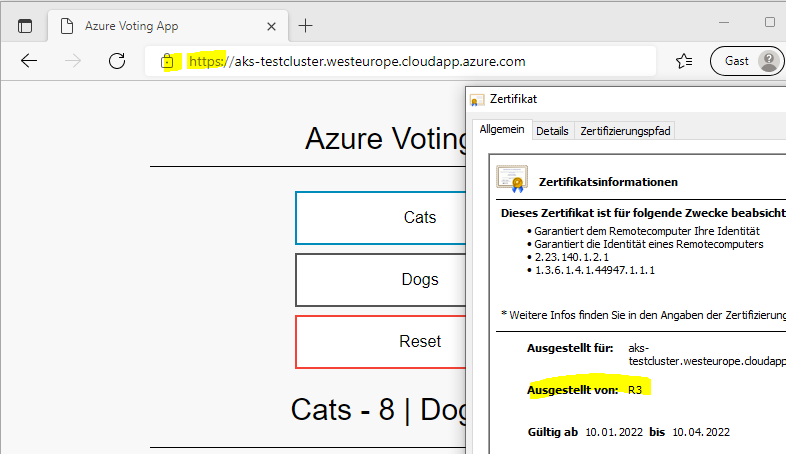

# Azure Kubernetes - Setup TLS ingress

>Documentation on the experiments carried out during the LabWeek 2022 on the AWK Cloud Lab

>Main contact: Werner Baumann (werner.baumann@awk.ch)

> go back to [Azure Kubernetes](../README.md)

## Setting up TLS ingress with own certificate {#setup-tls-ingress-own}
As we have seen, we need to provide the ingress with a certificate of our own. This can be done in two ways:
- issue own certificate (see also https://docs.microsoft.com/en-us/azure/aks/ingress-own-tls#generate-tls-certificates)
- use cert-manager (see also https://docs.microsoft.com/en-us/azure/aks/ingress-tls?tabs=azure-cli)

But before that, make sure our application can be reached at a DNS name, not only by public IP address.

### Add an A record to your DNS zone
In order that the Ingress Controller has a DNS name (only available as long as the service is **not** deleted, i.e. you do not delete the Ingress Controller), go through the following steps:
- on the Azure portal, find the automatically created resource group of your AKS cluster in your subscription.

Then, move on to the configuration of the public IP address:



alternatively, do all this by CLI.
#### - the Azure way: 
Get the ID of your public IP address (in our case, 20.82.67.215).
```
    az network public-ip list --query "[?ipAddress!=null]|[?contains(ipAddress, '20.82.67.215')].[id]" --output tsv
```
gives you the ID of the public IP address object which we need to alter.
```
    az network public-ip update --ids /subscriptions/35d6c10f-be8b-4d64-8771-7c4d9be0e318/resourceGroups/mc_rg-euwe-dev-labweek22-darkclouds_aks-testcluster_westeurope/providers/Microsoft.Network/publicIPAddresses/kubernetes-a25f71f443a0e41e588e8417e65b0719 --dns-name aks-testcluster
```
sets the DNS name for our public IP address to "aks-testcluster". Note that in the JSON returned, you find your fully qualified domain name (FQDN is in the property dnsSettings.fqdn):
```json
{
  ...
  "dnsSettings": {
    "domainNameLabel": "aks-testcluster",
    "fqdn": "aks-testcluster.westeurope.cloudapp.azure.com",
    "reverseFqdn": null
  },
  ...
}
```
#### - the Kubernetes way:
```
  helm upgrade my-nginx-ingress ingress-nginx/ingress-nginx \
    --namespace nginx-ingress \
    --set controller.service.annotations."service\.beta\.kubernetes\.io/azure-dns-label-name"="aks-testcluster"
```

Either way, after this step, our appliction is now reachable at our DNS name, not only by IP address:



### Create own certificate, store it as a secret into AKS
Creating our own certificate can be done easily with openssl.
It can be downloaded from https://slproweb.com/products/Win32OpenSSL.html or build from https://www.openssl.org/source/. Dont forget to set the PATH variable!

Open a shell and issue the following command
```
    openssl req -x509 -nodes -days 365 -newkey rsa:2048 \
    -out ingress-nginx.crt \
    -keyout ingress-nginx.key \
    -subj "/CN=aks-testcluster.westeurope.cloudapp.azure.com/O=ingress-nginx"
```
This results in a RSA public and private key in our current directory. Now, these have to be made available to our AKS cluster as a secret:
```
    kubectl create secret tls azure-vote-front-ingress-nginx \
    --key ingress-nginx.key \
    --cert ingress-nginx.crt
```

**Note**: the secret is created in the default namespace, where our application is deployed, too. Make sure that the **secret** is created in the **same namespace** as your **application**!


### Configure Ingress Controller to use TLS
Now we configure the ingress to use the secret. This is done with a [TLS ingress controller configuration](./azure-vote-https-ingress.yaml) that looks like this:
```yaml
  apiVersion: networking.k8s.io/v1
  kind: Ingress
  metadata:
    name: azure-vote-front-ingress
    annotations:
      kubernetes.io/ingress.class: nginx
      nginx.ingress.kubernetes.io/ssl-redirect: "true"
      nginx.ingress.kubernetes.io/use-regex: "true"
      nginx.ingress.kubernetes.io/rewrite-target: /$1
  spec:
    tls:
    - hosts:
      - aks-testcluster.westeurope.cloudapp.azure.com
      secretName: azure-vote-front-ingress-nginx
    rules:
    - host: aks-testcluster.westeurope.cloudapp.azure.com
      http:
        paths:
        - path: /vote(/|$)(.*)
          pathType: Prefix
          backend:
            service:
              name: azure-vote-front
              port:
                number: 80
        - path: /(.*)
          pathType: Prefix
          backend:
            service:
              name: azure-vote-front
              port:
                number: 80
```
Note that
- there is a new section ```tls```
- the ```hosts``` in the section ```tls``` have to match the ```host``` in the ```rules``` section .. this how the ingress controller knows which certificate to use for which host

Apply this configuration with
```
    kubectl apply -f azure-vote-https-ingress.yaml
```
and you get 
```
    ingress.networking.k8s.io/azure-vote-front-ingress configured
```

Now, our test application can be reached at ```https://aks-testcluster-westeurope.cloadapp.azure.com```, but still the certificate is not trusted by our browser, as we did issue it ourselves:



To remedy this situation, we really need to have a certificate issued by an PKI that is accepted worldwide. This can be done using the [cert-manager](https://github.com/jetstack/cert-manager).


## Setting up TLS ingress with cert-manager {#setup-tls-ingress-cert-manager}

In order that the certificates are issued by a well-known PKI, and that they remain valid, they need to be taken care of and renewed before they expire. To achieve this, we will use [cert-manager](https://github.com/jetstack/cert-manager)  and certificates issued by Let's Encrypt!. However, you could set all this up using another PKI then Let's Encrypt. The steps to be taken are similar, the configuration might differ in some parts. For more information on the different issuer types, head over to https://cert-manager.io/docs/configuration/.

The steps coming up are mostly based on https://cert-manager.io/docs/tutorials/acme/ingress/. 

First, tell helm in which repository cert-manager is available .. you did install helm as described in [Install an Ingress Controller - the longer way](../3-add-ingress/README.md#longer-way), didn't you? 
If you did not (and therefore do **not** use ```helm```), then go ahead with the instructions at https://cert-manager.io/docs/installation/#default-static-install to install cert-manager with a simple deployment.

If you installed ```helm```, use
```
  helm repo add jetstack https://charts.jetstack.io
  helm repo update
```
Then, install the cert-manager into the AKS cluster
```
  helm install \
  my-cert-manager jetstack/cert-manager \
  --namespace cert-manager \
  --create-namespace \
  --set installCRDs=true
```

Now that cert-manager is installed, we need to configure either a ClusterIssuer or an Issuer. They are more or less the same functionality, but either for the **cluster** or only inside its **own namespace**. For the sake of simplicity, we use a ClusterIssuer in this example. The configuration is very similar.

### Configure ClusterIssuer
As the rate limiting on Let's Encrpyt production is not accepting a lot of errors, we create a staging ClusterIssuer first to see if our setup is correct. Once we are sure it works, we can change the ClusterIssuer to the production of Let's Encrpyt.

The YAML for the [staging cluster issuer](./staging-cluster-issuer.yaml) looks like this:
```yaml
  apiVersion: cert-manager.io/v1
  kind: ClusterIssuer
  metadata:
    name: letsencrypt-staging
    namespace: default
  spec:
    acme:
      email: user@example.com
      privateKeySecretRef:
        name: letsencrypt-staging
      server: https://acme-staging-v02.api.letsencrypt.org/directory
      solvers:
      - http01:
          ingress:
            class: nginx
```
**Note**:
- ```kind``` can be ```ClusterIssuer``` or ```Issuer```. If ```Issuer``` is used, the ```namespace``` **MUST** match the namespace of your application
- ```email``` must be set to your own email, in order that you receive notifications by Let's Encrypt.

Apply the configuration using
```
  kubectl create --edit -f staging-cluster-issuer.yaml
```
The option ```--edit``` allows you to **edit the email address** before deploying the file. Make sure it is correct!
To see your cluster issuer configuration
```
  kubectl describe clusterissuer letsencrypt-staging
```
Once the issuer is ready, also create the [cluster issuer for the production environment](./production-cluster-issuer.yaml) at Let's Encrypt:
```
  kubectl create --edit -f production-cluster-issuer.yaml
```

### Configure TLS on application ingress
With all this in place, we are now ready to change our ingress to use a certificate issued by Let's Encrypt ([azure-vote-https-ingress-cert-manager-stage.yaml](./azure-vote-https-ingress-cert-manager-stage.yaml)):
```yaml
  apiVersion: networking.k8s.io/v1
  kind: Ingress
  metadata:
    name: azure-vote-front-ingress
    annotations:
      kubernetes.io/ingress.class: nginx
      nginx.ingress.kubernetes.io/ssl-redirect: "true"
      nginx.ingress.kubernetes.io/use-regex: "true"
      nginx.ingress.kubernetes.io/rewrite-target: /$1
      cert-manager.io/cluster-issuer: "letsencrypt-staging"
  spec:
    tls:
    - hosts:
      - aks-testcluster.westeurope.cloudapp.azure.com
      secretName: azure-vote-front-ingress-nginx-cert-manager
    rules:
    - host: aks-testcluster.westeurope.cloudapp.azure.com
      http:
        paths:
        - path: /vote(/|$)(.*)
          pathType: Prefix
          backend:
            service:
              name: azure-vote-front
              port:
                number: 80
        - path: /(.*)
          pathType: Prefix
          backend:
            service:
              name: azure-vote-front
              port:
                number: 80
```
Note that
- we are now using the secret ```azure-vote-front-ingress-nginx-cert-manager``` which is created by the cert-manager

Apply this ingress configuration
```
  kubectl apply -f azure-vote-https-ingress-cert-manager-stage.yaml
```
and check the certificate is ready with
```yaml
  kubectl get certificate
```
```
  NAME                                          READY   SECRET                                        AGE
  azure-vote-front-ingress-nginx-cert-manager   True    azure-vote-front-ingress-nginx-cert-manager   10m
```
If the result shows **true** for the READY-state, then we can start to use it (you can sneek a peak on the test below, but be assured the staging issuer does not issue trusted certificates). Therefore, we now change the [Ingress configuration to use the production issuer](./azure-vote-https-ingress-cert-manager-prod.yaml).
```
  kubectl apply -f azure-vote-https-ingress-cert-manager-prod.yaml
```
The only difference between the old (staging) and new (production) configuration is the ```cluster-issuer``` used
```yaml
    cert-manager.io/cluster-issuer: "letsencrypt-prod"
```
Once again, check if the (new production) certificate is ready, and if so .. proceed to test it.

### Test our app with Ingress Controller and ```https://```
Now, open your browser at [https://aks-testcluster-westeurope.cloadapp.azure.com/vote](https://aks-testcluster-westeurope.cloadapp.azure.com/vote) and you reach our application using the TLS enabled ingress controller - this time using ```https://```!



As you can see, the Ingress Controller provides his service now with a certificate that is issued by Let's Encrypt R3 and that is trusted by our browser. The certificate will be renewed as necessary by the cert-manager. This is what you expect for a business application!


Return to the main article [Azure Kubernetes](../README.md#remove-resources) and [remove all the resources from this example](../5-remove-resources/README.md).
