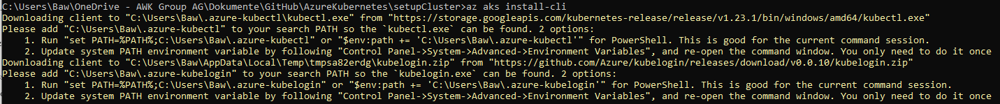

# Azure Kubernetes

>Documentation on the experiments carried out during the LabWeek 2022 on the AWK Cloud Lab

>Main contact: Werner Baumann (werner.baumann@awk.ch)

## Main goal for the Labweek
Automate ingress for an AKS service with TLS, provide basic template to apply setting for other services.

## First steps

First of all, make sure you have a basic understanding on Azure and the Azure portal. If not, head over to the [ACL Onboarding Course for Azure](https://github.com/awkgroupag/ITA-ACL-Onboarding/blob/main/Azure_version/main.md).

## Setup tools {#setup-tools}
In order to access Azure and the AKS cluster from the command line, you might want to install the *Azure CLI* locally.
- navigate to https://docs.microsoft.com/en-us/cli/azure/install-azure-cli-windows?tabs=azure-cli]
- download Azure CLI
- install
- open a CMD window or powershell
- type
```
    az aks install-cli
```

- follow the instructions shown afterwards to setup PATH (and make sure you use the values shown in the output) 
- once you are done (I recommend setting the system PATH environment), login to the AzureCloud with
```
    az login
```
- that's it, your are ready to use the *Azure CLI*.

## Setup of the AKS cluster {#setup-aks-cluster}
>❗In the Azure portal, make sure you have a subscription that has enough permission to setup an AKS cluster. Learning sandboxes might not. ;-)

Setting up the cluster is described [here](1-setup-cluster/README.md).

## Deploy a first application {#deploy-first-application}
In this [section](2-deploy-first-application/README.md) we deploy a simple application to our cluster.

## Add ingress for your application {#add-ingress}
Now we [add an ingress controller](3-add-ingress/README.md).

## Add TLS ingress for your application {#add-tls-ingress}
Now we [setup TLS for our ingress controller](4-add-tls-ingress/README.md).

## Remove resources from Azure {#remove-resources}
Once you are fed up with voting, remove all the resources built up in this course from Azure. Open [remove resources](4-remove-resources/README.md) to see how this is done.


## Important links and stuff to read
- https://docs.microsoft.com/en-us/azure/aks/
    gives a good overview on all topics regarding AKS and how to use, configure, develop etc.


Back to [Part 2](../../main.md)

Back to [overview page](../../../main.md)