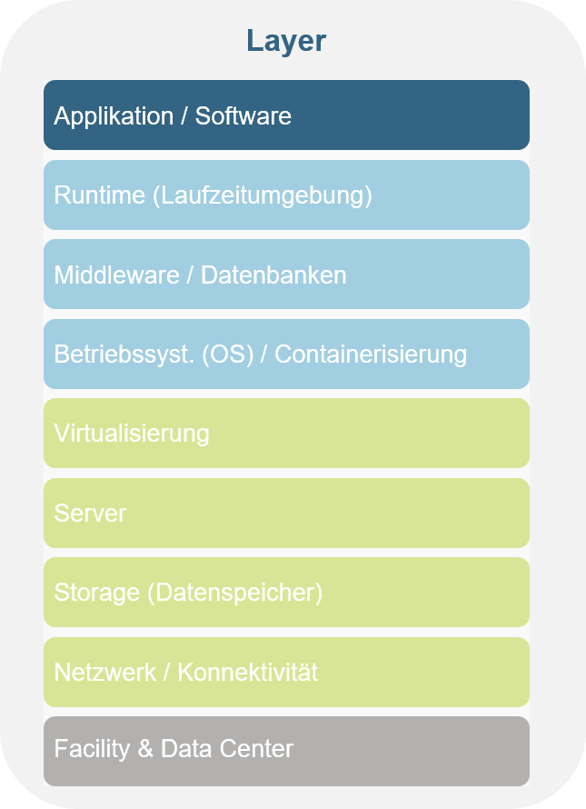

# Power Platform

Description:
Power Platform combines three powerful tools to provide workplace automation and runs in the cloud. It consists of:

* **Power Automate** allows users to create automated workflows between application and other services and helps automate visual processes related to communication, collaboration, data collection or approval flows.
* **Power Apps** enables building visual applications with automatic workflows between application and other services and helps automate visual processes in communication, collaboration, data collection or approval flows.
* **Power BI** is an analytics service that clarifies data analysis. It allows to display data in the form of dashboards or reports.

## Fact Sheet

[❌ TODO Insert fact sheet based on Joel's proposal]

You are at this layer of cloud computing:

## Learning Path

We prepared [a short tutorial](https://awkgroup.sharepoint.com/:p:/r/sites/DIV-AWKCloudLab-6403109Z/Freigegebene%20Dokumente/General/01_Onboarding/Power%20Platform%20Tutorial.pptx?d=w719a00cc8ddf4574bf1788d74b045bd2&csf=1&web=1&e=WulsDE) that you can do by yourself.

We also wanted to include short tutorials from Microsoft that dive a little bit deeper:

* [Power Automate](https://docs.microsoft.com/en-us/learn/modules/get-started-flows/) (Note regarding unit 5: if you do not have a twitter account, search instead for "Microsoft Teams" and use one of the triggers like "When a new channel message is added")
* [Power Apps](https://docs.microsoft.com/en-us/learn/modules/get-started-with-powerapps/)
* [Power BI](https://docs.microsoft.com/en-us/learn/modules/build-your-first-power-bi-report/1-introduction) (Tutorial can also be done with the [online version of Power BI](https://app.powerbi.com/))

## ACL Projects that make use of this resource

* Special contribution bonus tool (Power App & Power Automate)
* Project evaluation zone (Power App & Power Automate)

Back to [Part 2](../main.md)

Back to [overview page](../../main.md)
