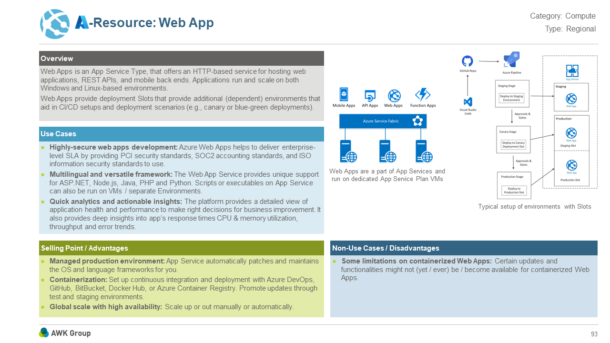
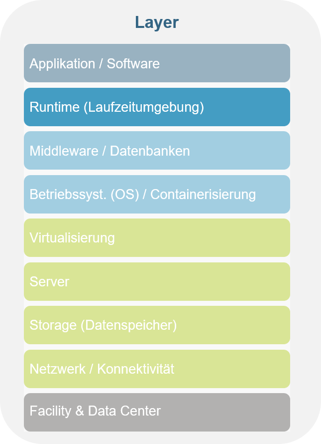

# Azure Webapp

Description:
Azure Webapps can be used to create and deploy scalable web applications. They run on container or App service plans that replace the web server.

## Fact Sheet

You are at this layer of cloud computing:

## Learning Path

Choose one:

* [Create WebApp using Azure Portal and Zip Deploy](https://docs.microsoft.com/en-us/learn/modules/host-a-web-app-with-azure-app-service/)
* [Create WebApp using Visual Studio](https://docs.microsoft.com/en-us/learn/modules/publish-azure-web-app-with-visual-studio/)
* [Deploy a containerized WebApp](https://docs.microsoft.com/en-us/learn/modules/deploy-run-container-app-service/)

Want to take a deeper dive:

* [Deploy WebApp with deployment slots](https://docs.microsoft.com/en-us/learn/modules/stage-deploy-app-service-deployment-slots/)

## ACL Projects with use of this ressource

* Wheel of Knowledge (frontend)
* Museum app (frontend)

Back to [Part 2](../main.md)

Back to [overview page](../../main.md)
