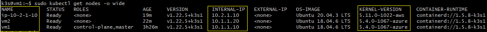
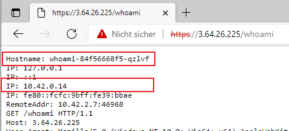

# Lab: Install k3s cluster on VMs in Azure und AWS

>Documentation on how to setup a k3s (Lightweight Kubernetes) cluster on Azure and AWS

>Main contact: Werner Baumann (werner.baumann@awk.ch)

---
## Preparation
In order to start, we need to have some prerequites in place. If not yet there, create the necessary keys and install the necessary tools on your computer.

### Create SSH keys
Create SSH keys to access the virtual machines over SSH.
#### Azure
```bash
    # create SSH key for login on Azure virtual machines
    ssh-keygen \
    -t rsa \
    -b 4096 \
    -C "azure" \
    -f ~/.ssh/id_azure \
    -N <key-passphrase>
```
#### AWS
```bash
    # create SSH key for login on AWS virtual machines
    ssh-keygen \
    -t rsa \
    -b 4096 \
    -C "aws" \
    -f ~/.ssh/id_aws \
    -N <key-passphrase>
```
#### k3s
> **TODO**: choose user, choose on how to deploy .. where is k3sup installed? see further below ..
```bash
    # create SSH key for user k3s/ubuntu
    ssh-keygen \
    -t rsa \
    -b 4096 \
    -C "k3s" \
    -f ~/.ssh/id_k3s \
    -N <key-passphrase>
```

### Download and install Terraform
- download from https://www.terraform.io/downloads
- install it
- set the path in the command shell you are using

---

## Useful links
For all of you who want to read further information on this topic, see these links below for additional, step-by-step instructions. These where the basics used for this experiments.
> **TODO**: read on provisioning on Google Cloud Platform and with Terraform: https://nimblehq.co/blog/provision-k3s-on-google-cloud-with-terraform-and-k3sup
- to learn about k3s: https://k3s.io/ and https://rancher.com/docs/k3s/latest/en/ and https://github.com/k3s-io/k3s
- ```k3sup```, a tool for easy setup of k3s: https://github.com/alexellis/k3sup

Basics on the VPN network between Azure and AWS are covered in another Lab. Therefore, go see [Lab: VPN Network connectivity between VMs on Azure und AWS](/Azure_version/part-2-use-cases/mandatory/networking/vpntest/README.md) for the Lab and references on the setup of the VPN, including step-by-step instructions on how to set it up.

---

## Setup network connectivity between Azure and AWS
This lab is accompanied by some Terraform scripts that (see [main.tf](main.tf)). They will setup the necessary VPN network between Azure and AWS, and provision three virtual machines which we use to install Kubernetes on it.

You might have specific requirements on the network. Before installting with Terraform, check and adapt the settings in [variables.tf](variables.tf) and then type
```bash
    terraform init
    terraform apply
```
in the actual path. 

The setup for the VPN might take **~45 minutes** (the setup of a VirtualNetwork-Gateway at Azure takes about 30 minutes itself). After this, the built-up infrastructure is ready for us to install Kubernetes.

### Resulting infrastructure
At this point, 
- all VMs are reachable by SSH from the internet
    - when logging in, be aware that the username on the Azure VMs was specified while creating them (see [variables.tf](variables.tf) of ```terraform```), while the username on AWS is fixed, depending on the image (see https://docs.aws.amazon.com/AWSEC2/latest/UserGuide/managing-users.html)
    - vm1, vm2: ubuntu (or the ```<username>``` you specified in the Terraform  [variables.tf](variables.tf))
    - vm3: ubuntu
> **ATTENTION**: The settings and access to these systems is **NOT** acceptable for production use!!

```bash
    # login to all VMs (execute each command in a separate window)
    ssh -i ~/.ssh/id_azure <username>@<public IP address vm1>
    ssh -i ~/.ssh/id_azure <username>@<public IP address vm2>
    ssh -i ~/.ssh/id_aws ubuntu@<public IP address vm3>
```

---

## k3s Prerequisites
> **TODO**: add this setup into the Terraform scripts, in order that there is no need to use AWS CLI in this lab.
- see https://rancher.com/docs/k3s/latest/en/installation/installation-requirements/
    - open ports TCP 6443, UDP 8472 and TCP 10250 on the VPN connection between Azure and AWS for 10.1.0.0/16
    - this is done by adding them to the AWS security group that is used in our setup
```bash
    # get ID of default security group 
    AWS_DEF_SG_ID=$(aws ec2 describe-security-groups \
        --query 'SecurityGroups[].{GroupId:GroupId}' \
        --output text \
        --filters Name=vpc-id,Values=vpc-03661614fb95b5740)

    # allow TCP 6443 from 10.1.0.0/16
    aws ec2 authorize-security-group-ingress \
        --group-id $AWS_DEF_SG_ID \
        --ip-permissions 'IpProtocol=tcp,FromPort=6443,ToPort=6443,IpRanges=[{CidrIp=10.1.0.0/16,Description="k3s from Azure VPN"}]'

    # allow UDP 8472 from 10.1.0.0/16
    aws ec2 authorize-security-group-ingress \
        --group-id $AWS_DEF_SG_ID \
        --ip-permissions 'IpProtocol=udp,FromPort=8472,ToPort=8472,IpRanges=[{CidrIp=10.1.0.0/16,Description="k3s from Azure VPN"}]'

    # allow TCP 10250 from 10.1.0.0/16
    aws ec2 authorize-security-group-ingress \
        --group-id $AWS_DEF_SG_ID \
        --ip-permissions 'IpProtocol=tcp,FromPort=10250,ToPort=10250,IpRanges=[{CidrIp=10.1.0.0/16,Description="k3s from Azure VPN"}]'
```
At AWS, we want to make sure to be able to access our cluster with ```https://```, therefore, we add another rule:
```bash
    # allow TCP 443 (https://) from 0.0.0.0/0
    aws ec2 authorize-security-group-ingress \
        --group-id $AWS_DEF_SG_ID \
        --ip-permissions 'IpProtocol=tcp,FromPort=443,ToPort=443,IpRanges=[{CidrIp=0.0.0.0/0,Description="https:// from Internet"}]'
```

# Install k3s
We will install k3s on all nodes (virtual machines), but ```vm1``` will be our master. Therefore, we create an additional SSH Key on vm1 to be used for the setup of k3s.
If you need further details or want to read on about ```k3sup```, have a look at the section **Useful links** above.

## Create an SSH key on vm1 for user k3s?? ubuntu??
>**TODO**: which user? k3s? ubuntu? see above and below .. :-/

Login to vm1, use your user created above
```bash
    # create SSH key for user k3s/ubuntu
    ssh-keygen \
    -t rsa \
    -b 4096 \
    -C "k3s" \
    -f ~/.ssh/id_k3s \
    -N <key-passphrase>
```
- ssh-keygen as above
- copy public key into file .ssh/authorized_keys on vm1, vm2 and vm3
    - it is now possible to login from vm1 as k3s@vm2 and ubuntu@vm3
    - also on vm1: needed to contact SERVER_IP in k3sup

> **TODO**: this is awkward. I am sure there are better ways, like
> - use same user for all VMs, e.g. ubuntu as in AWS you can not select it
> - install k3sup on your notebook, create key there, install from there
>   - use ssh-copy-id to get the keys where they need to go

## install k3sup on vm1 (see https://github.com/alexellis/k3sup)
```
    curl -sLS https://get.k3sup.dev | sh
    sudo install k3sup /usr/local/bin/

    k3sup --help
```

## install k3s on vm1 as server
```
    sudo k3sup install --local
```
check if server is running
```
    # Test your cluster with:
    export KUBECONFIG=/home/k3s/kubeconfig
    sudo kubectl config set-context default
    sudo kubectl get node -o wide
```

## install k3s as slave on vm2 and vm3
```bash
    # needed in order that id_k3s can be used instead of id_rsa
    eval `ssh-agent`
    ssh-add ~/.ssh/id_k3s
    
    # vm2 has same username on server/agent
    export SERVER_IP=10.1.1.10
    export AGENT_IP=10.1.1.20
    export USER=k3s
    k3sup join --ip $AGENT_IP --server-ip $SERVER_IP --user $USER

    # vm3 has different username on server/agent
    export AGENT_IP=10.2.1.10
    export USER=ubuntu
    export SERVER_USER=k3s
    k3sup join --ip $AGENT_IP --server-ip $SERVER_IP --user $USER --ssh-key ~/.ssh/id_k3s --server-user k3s
```
- check result on cluster
```
    sudo kubectl get nodes -o wide
```


> **Note**: as you can see, on each VM there is one node, and the IP addresses are internal. Furthermore, OS version and Linux-Kernel version are different between Azure and AWS.

## Test our setup
- we now deploy a simple service ```whoami```, which will display some information about the node on which it is deployed. Make sure we run 3 (three) replicas on different nodes. 


```bash
    sudo kubectl apply -f whoami.yaml
```
The file [whoami.yml](./whoami.yml) contains the deployment and an ingress definition.
- check if our new service is reachable through the ingress controller. Use your browser with the public IP address of the VMs, e.g. [```https://3.64.26.225/whoami```](https://3.64.26.225/whoami)



- the hostname is madeup from the servicename, the deployment (replica set) and a unique ID per replica
- the IP is the internal IP for this instance
- each time you reload the page, the information changes and cycles through your number of replicas (e.g. 3)

    
## Clean up
- if you used Terraform to provision the resources, a simple ```terraform destroy``` will destroy all of it
    - if you have manually setup additional resources, you will have to delete them manually!
    
- if you followed this all through with Azure and AWS CLI, then this is how to delete all your stuff:
    - Azure: directly delete the resource group. All objects in the resource group will be deleted, too.
    - AWS:
        - start with deleting the VM, then the key pair
        - next, delete and detach the VPN site-to-site connection, the Virtual Private Gateway, the Customer Gateway and the Internet Gateway
        - now, delete the subnet, and the VPC
        > you might get a response reading "you can **not** delete X, as long as Y is using it". If so, delete Y, and then continue with deleting X.
